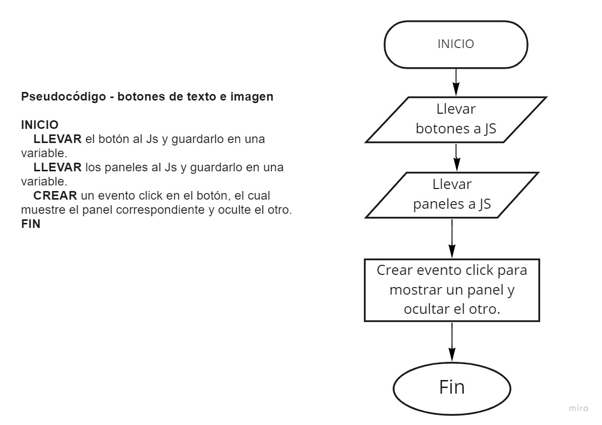

# Proyecto - Generador de memes
---
Bienvenid@s a mi segundo proyecto el cual realice durante el curso de frontend en ADA ITW, el mismo consiste en un editor para generar memes, en el que podrás manipular, tanto el texto como la imagen de tu meme, y finalmente descargar tu meme para compartirlo donde quieras.

[Enlace al editor de memes](https://stefaniadiazv.github.io/Proyecto-Generador-de-memes/)

---
## Tecnologías 👩🏽‍💻
Este proyecto fue creado con HTML5, CSS y JavaScript.

## Funcionalidades ⚙️

### Generales
- Alternar entre paneles de texto e imagen.
- Descargar imagen 
- Alternar entre modo claro y modo oscuro.

### Panel de texto
- Editar texto superior e inferior
- Quitar el texto superior e inferior
- Cambiar la tipografía
- Cambiar el tamaño de la fuente
- Cambiar la alineación del texto
- Cambiar el color de la letra
- Cambiar el color del fondo del texto
- Fondo transparente 
- Cambiar el espaciado
- Cambiar el interlineado

### Panel de imagen
- Añadir imagen por medio de una url
- Cambiar el color del fondo de la imagen
- Cambiar el modo de mezcla de la imagen 
- Aplicar filtros
- Reestablecer filtros

### Pseudocódigo y DFD

---
El proyecto cuenta con diseño responsive y accesibilidad para mejorar la experiencia del usuario.

Gracias por visitar mi perfil 😊

